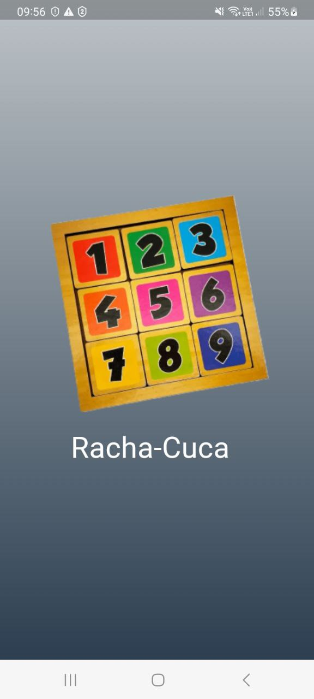
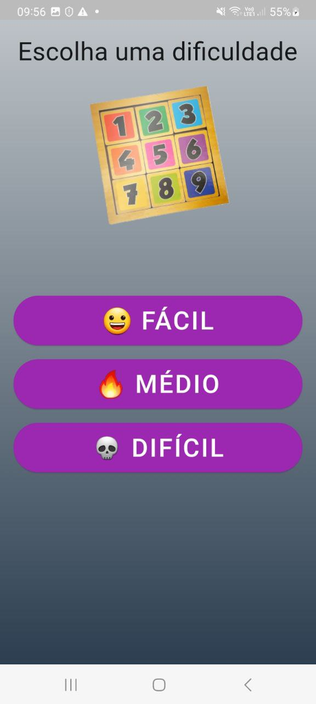
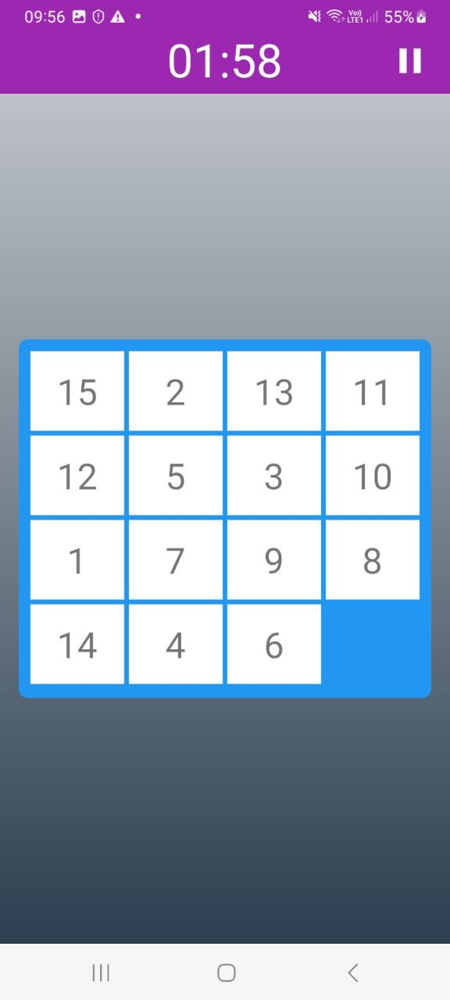

# Racha Cuca Números

Este é um aplicativo usado para simular um jogo muito conhecido pelas crianças, o chamado Racha Cuca. Ele
consiste em um tabuleiro 4 x 4 com 15 números que devem ser inseridos por sequência. Os números vão de 1 a 15
sendo que o 16° espaço é vago para movimentar os números.

## 🎨 Projeto Design

## Para ver o design do projeto e ter uma visão geral de como ele funciona veja no [LINK DO FIGMA](https://www.figma.com/file/28CQYsZvVfRDabxCLQzLWE/Racha-Cuca?node-id=53795%3A27385&t=itDrIYUcKCnWZ60C-1)

## 🎮 Como jogar ?

Assim que abrir o App você será perguntado se deseja iniciar um jogo, as opções são:

- jogo com limite de tempo: O usuário define um limite entre:
  - facil: 7:00
  - medio: 5:00
  - dificil: 3:00

Assim que uma das opções são escolhidas o jogo trata de sortear uma sequencia embaralhavel destes números e
espera que o jogador acerte a sequência dentre 1 á 15 começando da esquerda para a direita.

Quando completado cada segundo restante será multiplicado por 10 e depois pela dificuldade, sendo que quando mais dificil, mais pontos
o usuário irá conseguir atingir, dando assim a pontuação final do usuário.

---

## 🤔 Como o jogo foi feito ?

Ele foi totalmente desenvolvido em Dart/Flutter usando as seguintes libs de terceiros.

- animated_text_kit
- google_fonts
- flutter_animate
